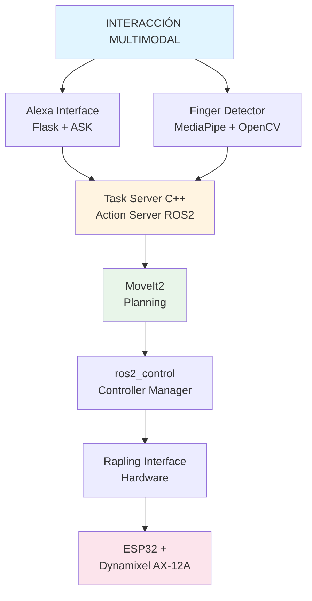

# 🤖 Robot Antropomórfico con Control Multimodal - ROS2

Sistema de control para robot antropomórfico de 4 grados de libertad que integra visión artificial, comandos de voz y planificación de trayectorias mediante ROS2 Humble.

## 🎯 Descripción General

Este proyecto implementa una arquitectura distribuida en ROS2 para el control de un robot manipulador mediante interacción multimodal, combinando:

- **Comandos de voz** a través de Amazon Alexa
- **Visión artificial** con detección de gestos mediante MediaPipe
- **Planificación de trayectorias** usando MoveIt2
- **Control de hardware** mediante interfaz personalizada ros2_control

## ✨ Características Principales

- ✅ Interfaz de hardware personalizada para comunicación serial con motores Dynamixel
- ✅ Detección de posición de mano en 3D usando MediaPipe Hands
- ✅ Integración con Alexa Skills Kit para control por voz
- ✅ Planificación automática de trayectorias con MoveIt2 y OMPL
- ✅ Visualización en tiempo real en RViz2
- ✅ Operaciones Pick & Place mediante gestos  

## 🏗️ Arquitectura del Sistema



## 🛠️ Tecnologías Utilizadas

### Sistema Operativo y Framework
- **Ubuntu 22.04 LTS** - Plataforma base con soporte hasta 2027
- **ROS2 Humble Hawksbill** - Framework de robótica distribuida

### Control y Planificación
- **MoveIt2** - Planificación de trayectorias y cinemática inversa
- **ros2_control** - Framework de control de hardware
- **OMPL** - Librería de planificación de movimientos
- **Plugin personalizado** - Interfaz de hardware para comunicación serial

### Visión Artificial
- **MediaPipe Hands** - Detección de 21 landmarks de mano en tiempo real
- **OpenCV** - Procesamiento de imagen y calibración de cámara
- **TF2** - Transformaciones entre sistemas de coordenadas

### Interacción de Voz
- **Amazon Alexa Skills Kit** - Procesamiento de comandos de voz
- **Flask** - Servidor web para comunicación con Alexa
- **ngrok** - Túnel HTTPS para desarrollo local

### Hardware
- **ESP32** - Microcontrolador dual-core para gestión de motores
- **Dynamixel AX-12A** - Servomotores inteligentes con retroalimentación
- **Buffer 74LS241** - Adaptación de señal half-duplex TTL
- **Cámara Logitech C920s** - Sensor RGB para visión artificial

## 📦 Estructura de Paquetes

```
src/
├── rapling_description/       # Modelo URDF del robot
│   ├── urdf/                  # Archivos Xacro con geometría
│   ├── meshes/                # Modelos 3D (STL)
│   └── launch/                # Visualización en RViz
│
├── rapling_controller/        # Control de hardware
│   ├── include/               # Plugin de interfaz (HPP)
│   ├── src/                   # Implementación serial (CPP)
│   └── config/                # Controladores y límites
│
├── rapling_moveit_2/          # Configuración MoveIt2
│   ├── config/                # SRDF, cinemática, límites
│   └── launch/                # Move group + RViz
│
├── rapling_remote/            # Integración multimodal
│   ├── alexa_interface.py     # Servidor Flask + Alexa
│   └── task_server.cpp        # Action server de tareas
│
├── learning_topic/            # Visión artificial
│   ├── finger_detector.py     # Detección con MediaPipe
│   └── topic_webcam_pub.py    # Publicador de imagen
│
└── rapling_msgs/              # Mensajes personalizados
    └── action/                # Definición de acciones
```

## 🔧 Implementación Técnica

### 1. Modelo Digital del Robot
- Exportación desde SolidWorks usando plugin URDF Exporter
- Definición de 4 articulaciones rotacionales con límites
- Integración con ros2_control mediante tags Xacro
- Calibración de offsets entre cero simulado y cero físico

### 2. Interfaz de Hardware (rapling_controller)
- Plugin C++ basado en `hardware_interface::SystemInterface`
- Comunicación serial a 115200 baudios con ESP32
- Exportación de `StateInterface` y `CommandInterface` por articulación
- Conversión automática radianes ↔ grados con compensación de offsets
- Publicación de `JointState` para retroalimentación en tiempo real

### 3. Sistema de Visión (finger_detector)
- Captura de frames desde `/image_raw` (10 Hz)
- Detección de landmark 8 (punta del índice) con MediaPipe
- Conversión píxel → coordenadas 3D usando parámetros intrínsecos
- Transformación al frame `world` mediante TF2
- Detección de gesto: mano cerrada + posición estable (3s) = punto guardado
- Publicación de marcadores como `visualization_msgs/MarkerArray`

### 4. Integración con Alexa (alexa_interface.py)
- Servidor Flask en puerto 5000 expuesto mediante ngrok
- Handlers para intents: `LaunchRequest`, `PickIntent`, `WakeIntent`, `SleepIntent`
- Suscripción al tópico `/finger_poses` para obtener coordenadas
- Envío de goals al Action Server usando `rclpy.action.ActionClient`
- Ejecución en hilo separado para compatibilidad Flask + ROS2 spin

### 5. Servidor de Tareas (task_server.cpp)
- Action Server basado en `rclcpp_action`
- Recepción de goals con campo `task_number` (0-9)
- Interfaz con MoveIt2 mediante `MoveGroupInterface`
- Planificación con OMPL y parametrización temporal IPTP
- Ejecución mediante `arm_controller` (JointTrajectoryController)

### 6. Comunicación Hardware
- ESP32 con arquitectura dual-core:
  - **Core 0**: Lectura de encoders + envío de estados
  - **Core 1**: Procesamiento de comandos + control de motores
- Protocolo Dynamixel con daisy-chain en bus compartido
- Control de dirección half-duplex mediante GPIO4
- Compensación de motores acoplados (M2A/M2B en hombro)

## 🚀 Flujo de Operación

### Configuración Inicial

#### 1. Conexión del Hardware
```bash
# Verificar puerto serial disponible
ls /dev/ttyUSB*

# Si el puerto es diferente a /dev/ttyUSB0, modificar en:
# rapling_description/urdf/rapling_ros2_control.xacro
# <param name="port">/dev/ttyUSB0</param>
```

#### 2. Lanzar el Sistema Completo
```bash
# Inicia todos los nodos: control, MoveIt2, visión y Alexa
ros2 launch rapling_bringup real_robot.launch.py
```

> **⚠️ Importante:** Al iniciar, el robot ejecuta una rutina de **sincronización automática**:
> - Lee la posición actual de los motores
> - Mueve todas las articulaciones a la posición **HOME**
> - Si no alcanza la posición ideal, el programa no arrancará

#### 3. Configurar ngrok para Alexa
```bash
# Ejecutar ngrok para crear túnel HTTPS
ngrok http 5000

# Copiar la URL generada (ej: https://xxxx.ngrok.io)
# Configurarla en Alexa Developer Console como endpoint
```

**Recursos de configuración:**
- [Tutorial ngrok + Alexa parte 1](https://www.youtube.com/watch?v=dgKL519EF4Q&list=PL9R2s5XMUJUMrBar9WkCkY-oBbvG3DltF&index=76)
- [Tutorial ngrok + Alexa parte 2](https://www.youtube.com/watch?v=AkZKx2bMaQM&list=PL9R2s5XMUJUMrBar9WkCkY-oBbvG3DltF&index=77)

---

### Operación: Pick & Place con Gestos

#### Paso 1: Capturar Punto de Origen (Pick)
1. Coloque su **dedo índice** en la posición deseada
2. El sistema detecta automáticamente la punta del índice con MediaPipe
3. **Cierre el puño durante 3 segundos** para guardar el punto
4. Aparecerá una **esfera verde** en RViz marcando la posición

#### Paso 2: Capturar Punto de Destino (Place)
1. Mueva su mano a la segunda posición
2. Repita el gesto: **cierre el puño 3 segundos**
3. Aparecerá una segunda esfera verde en RViz

> **💡 Reiniciar puntos:** Abra completamente la mano para que el sistema vuelva a detectar el primer punto

#### Paso 3: Ejecutar con Comandos de Voz

**Opción A - Pick & Place:**
```
Usuario: "Alexa, Control Robot"          → Activa la Skill
Usuario: "Alexa, Ejecutar movimiento"    → Inicia secuencia Pick→Home→Place
```

**Opción B - Unir Puntos:**
```
Usuario: "Alexa, Control Robot"          → Activa la Skill
Usuario: "Alexa, Unir puntos"            → Robot traza línea entre puntos
```

#### Paso 4: Ejecución Automática
```
Alexa → Flask → Task Server → MoveIt2 planifica trayectoria
     → OMPL genera waypoints articulares
     → IPTP parametriza velocidades/aceleraciones
     → arm_controller ejecuta la trayectoria
     → Rapling Interface convierte rad→grados+offset
     → ESP32 envía comandos seriales a Dynamixels
     → Motores ejecutan el movimiento
```

## 📊 Resultados

- ✅ Conversión precisa entre cero simulado y físico de motores
- ✅ Detección estable de mano con precisión < 30px de desviación
- ✅ Trayectorias suaves con perfiles trapezoidales de velocidad
- ✅ Tiempo de respuesta < 2s desde comando de voz hasta inicio de movimiento
- ✅ Sincronización exitosa entre planificación y hardware real  

## 💻 Requisitos

- **Ubuntu 22.04 LTS**
- **ROS2 Humble**
- **Python 3.10+** con: `opencv-python`, `mediapipe`, `flask`, `ask-sdk-core`
- **Hardware**: ESP32, 4x Dynamixel AX-12A, Cámara USB, Alexa device

## 📖 Uso Rápido

```bash
# Visualización del modelo
ros2 launch rapling_description display.launch.py

# Sistema completo
ros2 launch rapling_controller controller.launch.py
ros2 launch rapling_moveit_2 moveit.launch.py
ros2 launch learning_topic vision_launch.py
python3 src/rapling_remote/alexa_interface.py
```

## 📧 Contacto

**Brayan Macana**

- 📧 Email: brayandayani@hotmail.com
- 📱 Teléfono: +57 312 364 4501
- 📍 Ubicación: Colombia

Para consultas, sugerencias o colaboraciones sobre el proyecto, no dudes en contactarme.

---

<p align="center">
  Desarrollado con ROS2 Humble | MoveIt2 | MediaPipe | Alexa Skills Kit
</p>
